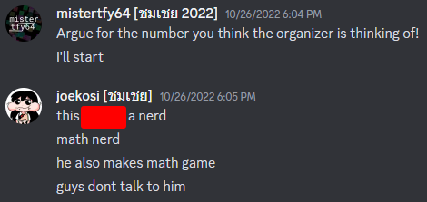

# Hello! 
My name is mistertfy64, and I am a stupid person who likes to make stuff harder for myself.

Currently I am the author of the original implementation of [Mathematical Base Defenders](https://mathematicalbasedefenders.com), a ~~fun~~ stupid "number-cruncher" styled math game with  registered players so far. 

I am also maintaining the original implementation of [UntitledPasswordFindingGame](https://untitledpasswordfindinggame.mistertfy64.com), my own implementation of a "puzzle-hunt contest management system" to host my own ~~fun~~ stupid puzzles.

Additionally, I have a personal website, which is at [https://mistertfy64.com](https://mistertfy64.com) where you can get more of my contact links.

I'm not that qualified to work in the software industry at the moment, but as a student, I did complete POSN Computer Camp 2 and won awards at various student-level competitions, which definitely makes me more credible. For a more formal way of assessing my achievements, you can view my [resume](https://storage.mistertfy64.com/resume.pdf) or [my certificate display](https://content.mistertfy64.com/portfolio/).

Feel free to contact me through my contact methods listed through my website, and I will get back to you as soon as possible. Note that formal requests/inquiries should be sent through my e-mail address, but I read (and try to reply to) all my social media messages nonetheless.

 
